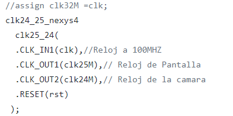
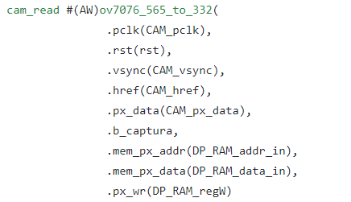
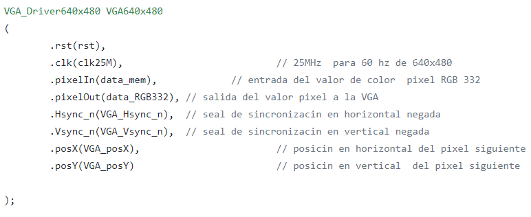
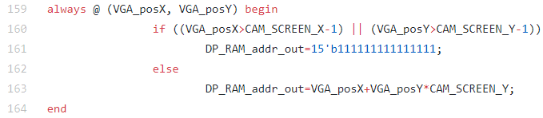
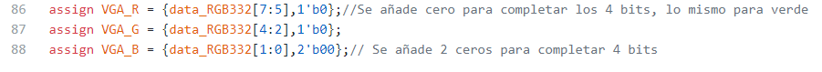

## TRABAJO FINAL DIGITAL I
BYRON ADOLFO ERAZO CHALUPUD

JHON EDISON BOHORQUEZ MARTINEZ

## INTRODUCCIÓN
En esta entrega se recoge todo el proceso seguido en el diseño e implementación de una cámara digital el cual se inicia con entrega 1 uno llamado work01 en donde se dio respuesta a interrogantes para la implementación la memoria RAM que utilizara la camara para el procesamiento de la imagen. En la segunda entrega work realizó el diseño e implementación de la captura de datos de la cámara "captura_datos_downsampler" según la configuración 320x240 16b pixel. Además de esto se realiza la adaptación del bloque PLL según la tarjeta de desarrollo Nexys 4 la cual cuenta con un dispositivo FPGA de la nueva familia de XILINX ARTIX  XC7A100T-1CSG324C. Para la tercera entrega work03 se realiza el diseño del cam_reed.v que permite la captura de datos por medio del uso de un botón externo.
## DESARROLLO DE MODULOS DE LA CAMARA

**1.	Contador de Pixel y Href WP02**

En este trabajo se realiza el diseño e implementación de la captura de datos de la cámara "captura_datos_downsampler" según la configuración 320x240 16b pixel. Además de esto se realiza la adaptación del bloque PLL, teniendo en cuenta que la señal de reloj viene de la FPGA Spartan 6 y la seleccionada por el grupo para la implementación del proyecto corresponde a la Artix 7, así como la adaptación de los datos para que se almacenen en la memoria, teniendo en cuenta que el formato debe ser RGB332. Una vez diseñado e implementado el bloque "captura_datos_dawnsampler", se procede a instanciarlo en el test_cam.v para probar la funcionalidad del diseño.

**Instanciación de modulos.** Lo primero que se realiza es la instanciación de los nuevos módulos que componen el proyecto, entre estos se encuentra el modulo **clk_25_nexys4.v** 

Se instanciaron los módulos de entrada y salidas del cam_read.v, partiendo del paquete del repositorio.

en donde se tiene como entradas de la camara (.pclk,rst, vsync, href, px_data, b_captura) y como salidas del modulo **tes_cam.v**  (mem_px_addr, mem_px_data, px_wr).

Instanciación salida VGA.

Mediante la siguiente lógica se obtuvo DP_RAM_addr_out, teniendo en cuenta la posición del pixel en pantalla, en el primer condicional se calcula la última posición y en el segundo se da la posición de la dirección de salida.

Para pasar de formato RGB332 a RGB 444 para ser usado por la pantalla VGA. Para hacer dicha conversión se añadieron ceros en las cifras menos significativas faltantes, es decir, para el rojo y el verde sólo se agregó un cero para completar los 4 y en el azul dos ceros.

**Dimensionamiento de espacio de memoria.**
Se determinar el tamaño máximo del buffer de memoria RAM que se puede crear con la FPGA, en este caso la Artix-7  de la tarjeta Nexys 4, para ello se revisó el datasheet.
Para una imagen de 320 x 240 píxeles. Se decide recortar el tamaño de la imagen para que no exceda la capacidad de la FPGA, se escala por un factor de 2, por lo que la nueva imagen es ahora 1/4 del tamaño con respecto al tamaño anterior. Por lo que el número de posiciones o píxeles totales es de 320 x 240 = 76.800.

**Captura de datos y downsampling (cam_read.v).**
comprende en una maquina de estados finita  la  cual recoje  los datos que provienen de la Cámara OV7670. El módulo está compuesto por el módulo de definición de estados, un contador, y un conjunto de flip flops que se encargan de guardar temporalmente los datos de entrada de la cámara, para ser enviados a la memoria RAM.

rst: Reinicia la captura de datos.
pclk: Señal PCLKde la camara . 
href: Señal HREF de la camara , indica la trasmision de una línea de pixeles.
vsync: Señal VSYNC de la camara de la senal para que empiece a trasmitir a al modulo de captura
px_data [7:0]:  (D[7:0]). informacion de colores 
b_captura: controla la captura de fotografias 

Salidas:
[16:0] mem_px_addr: dirección en memoria donde los bits del píxel serán guardados 
[7:0] mem_px_data: guarda la información obtenida de px_data correspondiente al píxel
px_wr:  indica si se escribe o no el valor almacenado en mem_px_data en la direccion de memoria 

**CAPTURADATOS.**

La cámara OV7670 genera 16 bits de datos de píxeles el cual  generar 8 de esos 16 bits durante un ciclo de reloj,  por lo que se necesitan dos ciclos para leer completamente los datos de píxeles. 
EL muestreo de  datos en el flanco de subida del reloj de la cámara. El formato de 16 bits de los datos de píxeles de la cámara es RGB565. Esto simplemente significa que los primeros 5 bits de los datos de píxeles de 16 bits son el valor del rojo, los siguientes 6 bits son el valor del verde y los últimos 5 bits son el valor del azul. Sin embargo, solo podemos almacenar 8 bits de datos de píxeles en nuestra RAM. 
Hicimos esto leyendo los dos bytes de datos de la cámara. Luego asignamos los bits apropiados del formato RGB 565 al formato RGB 332. Por ejemplo, los tres bits rojos de RGB 332 se toman de los primeros tres bits del primer byte de RGB 565. Los 3 bits verdes de RGB 332 se toman de los últimos tres bits del primer byte de RGB 565. Los 2 azules Los bits de RGB 332 se toman de los últimos dos bits del segundo byte de RGB 565. Después de reducir los datos, escribimos los datos de 8 bits en la RAM. Solo escribimos los datos de 8 bits después de leer los dos bytes completos de datos de la cámara.

